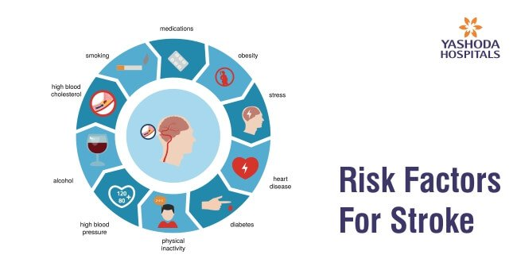
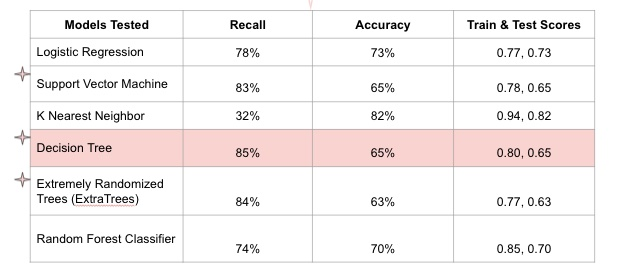

# Are you prone to a stroke?

According to the World Health Organization (WHO) stroke is the 2nd leading cause of death globally, responsible for approximately 11% of total deaths. It is the #1 leading cause of death in America ([source](https://www.cdc.gov/stroke/index.htm#:~:text=Stroke%20is%20a%20leading%20cause,of%20serious%20disability%20for%20adults.&text=About%20795%2C000%20people%20in%20the%20United%20States%20have%20a%20stroke%20each%20year.&text=Get%20more%20quick%20facts%20about,Stroke%20is%20preventable)).
This is clearly a glaring health issue that humans currently face. What exactly is a stroke? It is a blood clot that blocks the flow of blood and oxygen to the brain. When the brain does not receive blood it can result in death, but not every time. For stroke survivors, while escaping death, they may still live with other complications (from the loss of blood to the brain) such as memory loss, speech impairment, eating disabilities, and/or loss of normal bodily functions  ([source](https://www.hopkinsmedicine.org/health/conditions-and-diseases/stroke/effects-of-stroke)).

There are many known risk factors of strokes, as indicated in the below image.([source](https://www.yashodahospitals.com/blog/brain-stroke-and-treatments-symptoms-causes-treatment/))
 
Some of these factors are within a person's ability to change or at the very least be cognizant of the effects to monitor their risk for stroke. 

## Problem Statement
***Can patients with an affinity to having a stroke, be identified with a high degree of accuracy and sensitivity?***
As health data from smartphones, smartwatches, and even tech-friendly primary care facilities continues to accumulate, there is a real opportunity to identify those future at risk stroke victims. Prevention is possible and through this project we hope to aid in that pursuit. 
- Provide patients with targeted preventative measures
- Monitor patients predicted as high risk. Potentially integrate this monitoring into smart-wearables.

## Road Map
    1) Get data from Kaggle [source](https://www.kaggle.com/fedesoriano/stroke-prediction-dataset)
    2) Clean data
    3) Explore data for trends via Exploratory Data Analysis (EDA)
    4) Determine best models, tweak hyper parameters
    5) Review Top Model Performance 
    6) Explore Future Impact of Model
    
## EDA Highlights
    The Missing Data: Only 200 nulls under BMI. The median was used to convert.
    The Unknown Smokers: Treated as an ordinal variable. "Unknown": 0,"never smoked" : 1,"formerly smoked" : 2,"smokes" : 3
    Dropping Outliers: In the gender category, very few Other gender. These were dropped.
    Dummify Remaining Variables: The remaining categorical variables (marriage, residence, gender) were dummified in order to perform analysis with them.

**Top correlation features to stroke**: age, heart disease, glucose levels, hypertension and ever-been-married.
- Ever-been-married likely a byproduct of a multicolinearity relationship with age.

Data is extremely imbalanced. 0.05% of patients in data were stroke victims (248).
Techniques to handle imbalances prior to modeling:
- Oversampling 
- Undersampling
- Synthetic Minority Over-sampling Technique (SMOTE)

**Metrics**
Rather predict too many stroke victims than miss stroke victims so recall and accuracy will be the metrics to base the decision on.

## Modeling
Quite a few decent models resulted from testing.
- Used a standard scaler to scale data 
- Implemented RandomOverSampler for imbalance 
- Ran each model through a RandomizedSearchCV, CV of 3 to cover more ground.

**Models Tested:**
- Logistic Regression
- Support Vector Machine
- K Nearest Neighbor
- Decision Tree
- Extremely Randomized Trees (ExtraTrees)
- Random Forest Classifier

 

**Best Model:**
Decision Tree: Recall of 85%, Accuracy of 65%. Slightly overfit but performed best on recall. Top features included: Age (weight = 0.92), BMI, and Hypertension. All other features were ignored by the model.

## Results and Conclusions
*Can patients with an affinity to having a stroke, be identified with a high degree of accuracy and sensitivity?*
**Yes!**

Models performed above average. Most were overfit. The imbalanced classes created an uphill battle for the models. Interestingly two of the stronger correlating factors to stroke, average glucose level and hypertension, were non-factors for prediction in the best model. 

*How can this help patients in stroke prevention?*
- Age is the strongest stroke indicator. So if patients can turn back the clock they'll be fine! Realistically the model indicates that managing BMI and hypertension are a patient's best areas to keep at healthy levels in order to reduce stroke risk.

**Future Work**
- Get more data! Working with such a small imbalanced dataset was extremely difficult. More data on patients and more data on those patients with strokes will drastically improve the model and create more useful predictions for patients.
- Create a functioning site with streamlit for patients to discover their stroke risk 
- Incorporate this data with other health data to help determine stroke patient’s risk

